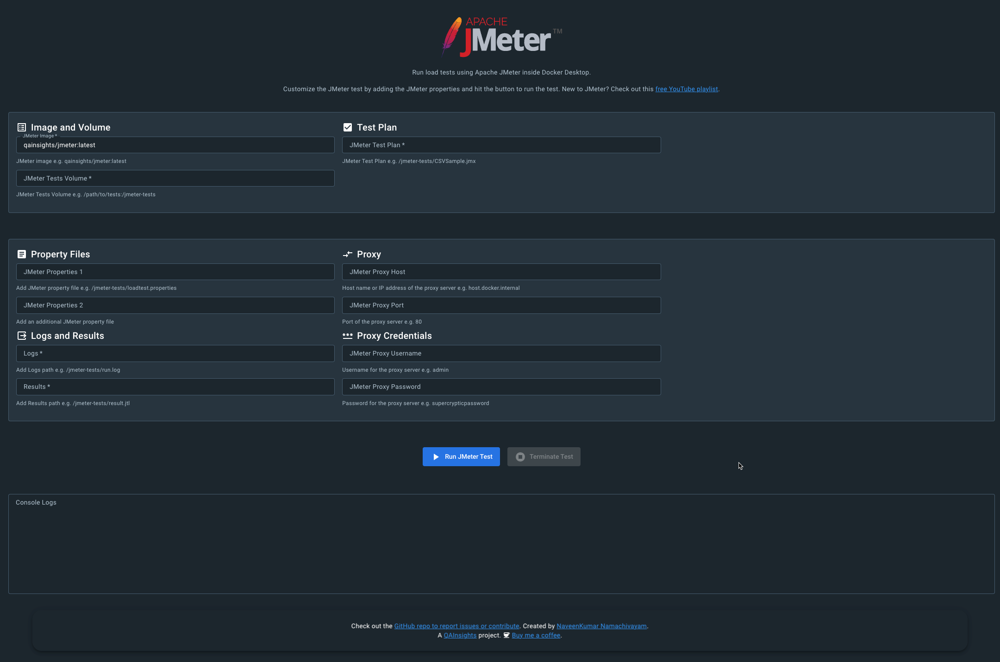

# ⚡️ Apache JMeter Docker Extension

Run your JMeter load tests without installing JMeter in your local inside Docker Desktop using this awesome extension.



# ⛳️ Features

✅ Includes base image `qainsights/jmeter:latest` by default  
✅ Light-weight and secured container  
✅ Supports JMeter plugins
✅ Mount volume for easy management  
✅ Supports property files  
✅ Supports proxy configuration  
✅ Generates logs and results  
✅ Intuitive HTML report  
✅ Displays runtime console logs  
✅ Timely notifications  

# 👨‍💻 Local development

You can use `docker` to build, install and push your extension. Also, using an opinionated [Makefile](Makefile) that could be convenient for you. There isn't a strong preference of using one over the other, so just use the one you're most comfortable with.

To build the extension, use `make build-extension` **or**:

```shell
  docker buildx build -t qainsights/jmeter-docker-extension:latest . --load
```

To install the extension, use `make install-extension` **or**:

```shell
  docker extension install qainsights/jmeter-docker-extension:latest
```

> If you want to automate this command, use the `-f` or `--force` flag to accept the warning message.

To preview the extension in Docker Desktop, open Docker Dashboard once the installation is complete. The left-hand menu displays a new tab with the name of the extension which is `JMeter`. You can also use `docker extension ls` to see that the extension has been installed successfully.

Use the `docker extension update` command to remove and re-install the extension automatically:

```shell
docker extension update qainsights/jmeter-docker-extension:latest
```
> If you want to automate this command, use the `-f` or `--force` flag to accept the warning message.

> Extension containers are hidden from the Docker Dashboard by default. You can change this in Settings > Extensions > Show Docker Extensions system containers.

# 🗑️ Clean up

To remove the extension:

```shell
docker extension rm qainsights/jmeter-docker-extension:latest
```

# ⏭️ What's next?

- More options to fine tune the resources
- Tests dashboard
- And more
