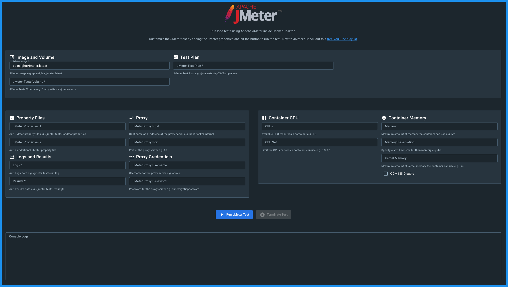

# ⚡️ Apache JMeter Docker Extension

Run your JMeter load tests without installing JMeter in your local inside Docker Desktop using this awesome extension.




# ⛳️ Features

✅ Includes base image `qainsights/jmeter:latest` by default  
✅ Light-weight and secured container  
✅ Interactive charts  
✅ Supports JMeter plugins  
✅ Mount volume for easy management  
✅ Supports property files  
✅ Supports proxy configuration  
✅ Support container memory and CPU settings  
✅ Generates logs and results  
✅ Intuitive HTML report  
✅ Displays runtime console logs  
✅ Timely notifications  

# ⤵ Demo

[](https://www.youtube.com/watch?v=OOm9iwC7f44 "Apache JMeter Docker Extension Demo")

# 👨‍💻 Local development

You can use `docker` to build, install and push your extension. Also, using an opinionated [Makefile](Makefile) that could be convenient for you. There isn't a strong preference of using one over the other, so just use the one you're most comfortable with.

To build the extension, use `make build-extension` **or**:

```shell
  docker buildx build -t qainsights/jmeter-docker-extension:latest . --load
```

## 🌱 Installation 
### 🪜 Make
To install the extension, use `make install-extension` **or**:

```shell
  docker extension install qainsights/jmeter-docker-extension:latest
```

> If you want to automate this command, use the `-f` or `--force` flag to accept the warning message.

### 🗜️ Docker Extensions Marketplace (Recommended Method)

JMeter extension can be easily installed from the [Docker Extensions Marketplace](https://hub.docker.com/search?q=&type=extension) via web or directly from Docker Desktop.

Docker Extensions are available as part of Docker Desktop 4.8.0 and later releases. [Download and install Docker Desktop 4.8.0 or later](https://docs.docker.com/desktop/release-notes/).

To install an extension:

1. Open Docker Desktop.
2. From the Dashboard, select Add Extensions in the menu bar. The Extensions Marketplace opens on the Browse tab.
Search for `JMeter`.
3. Choose you extension and select Install.

From here, you can select Open to access the extension or install additional extensions. The extension also appears in the left-hand menu and in the Manage tab.

## 🎥 Preview the extension

To preview the extension in Docker Desktop, open Docker Dashboard once the installation is complete. 

The left-hand menu displays a new tab with the name of the extension which is `JMeter`. You can also use `docker extension ls` to see that the extension has been installed successfully.

Use the `docker extension update` command to remove and re-install the extension automatically:

```shell
docker extension update qainsights/jmeter-docker-extension:latest
```
> If you want to automate this command, use the `-f` or `--force` flag to accept the warning message.

> Extension containers are hidden from the Docker Dashboard by default. You can change this in Settings > Extensions > Show Docker Extensions system containers.

# 🪵 Update an extension

You can update any extension outside of Docker Desktop releases. To update an extension to the latest version:

1. Navigate to Docker Dashboard, and from the menu bar select the ellipsis to the right of Extensions.
2. Select Manage. The Manage tab displays with all your installed extensions. If an extension has a new version available, it displays an Update button.
3. Select Update.

# 🗑️ Clean up

To remove the extension:

```shell
docker extension rm qainsights/jmeter-docker-extension:latest
```

1. Or from the menu bar, select the ellipsis to the right of Extensions.
2. Select Manage. This displays a list of extensions you've installed.
3. Select Uninstall.

# ⏭️ What's next?

- More options to fine tune the resources
- Tests dashboard
- And more
